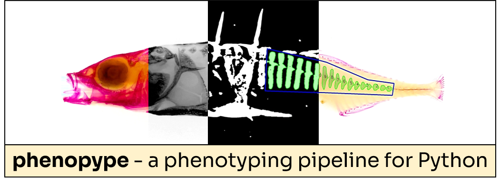

Phenopype: a phenotyping pipeline for Python
============================================

.. raw:: html

	

.. raw:: html

	

	 
	<strong>Phenopype is a high throughput phenotyping pipeline for Python to support ecologists and evolutionary biologists in extracting high dimensional phenotypic data from digital images</strong>. The core feature of this package are high level computer vision functions for image preprocessing, segmentation, and trait measurement that use <a href="https://github.com/opencv/opencv-python">OpenCV</a> (specifically: the pre-built opencv-python wheels) as a backbone. In addition, Phenopype provides basic project management routines that can automatically organize image data and create customizable analysis-templates (stored in human-readable YAML-format). After finishing a project, users can share or archive the project structure so that anyone can reproduce all collected data with only a few lines of code (suitable for repositories like DRYAD or OSF). Phenopype works most efficiently when used from an Integrated Development Environment (IDE), like Spyder, and requires only minimal Python coding skills.
	 
	 
	<strong>Getting started:</strong>
		<ol>
			<li><a href="installation.html">Install Phenopype </a> - via the <i>Python Package Index</i> (PYPI): <code>pip install phenopype</code></li> 
			<li><a href="tutorial_0.html">Run the Tutorials </a> - Tutorial 1 is for Python beginners, otherwise Tutorial 2 is a good starting point </li>
			<li><a href="#examples">Check the Examples</a> - Example 1 delineates a typical computer vision workflow </li>
		</ol>
	

	

	

	

	

	<h2>Documentation</h2>

.. toctree::
	:maxdepth: 2

	installation
	api
	resources
	
.. raw:: html
	
	

	

	<h2>Tutorials</h2>

.. toctree::
	:maxdepth: 1

	tutorial_0
	tutorial_1_python_intro
	tutorial_2_phenopype_workflow
	tutorial_3_managing_projects_1
	tutorial_4_managing_projects_2
	tutorial_5_gui_interactions
	tutorial_6_video_analysis

.. raw:: html

	

	

	

Examples
--------

.. raw:: html

	

	
		

			

			<a href="example_1_detect_objects_isopods.html">
			
.. image:: thumbs/ex1.jpg
			
.. raw:: html
			
			<b>
Detecting aquatic isopods
</b>
			<b>Organism: </b>waterlouse (or sowbug) 
			<b>Species: </b><i>Asellus aquaticus</i>  
			<b>Traits: </b>size, pigmentation, body-shape  
			</a>
			

		

		

			

			<a href="example_2_landmarks_stickleback.html">
			
.. image:: thumbs/ex2.jpg
			
.. raw:: html
			
			<b>
Placing landmarks
</b>
			<b>Organism: </b>threespine stickleback  
			<b>Species: </b><i>Gasterosteus aculeatus</i>  
			<b>Traits: </b>landmarks, geometric morphometrics  
			</a>
			

		

		

			

			<a href="example_3_phytoplankton.html">
			
.. image:: thumbs/ex3.jpg
			
.. raw:: html

			<b>
Detecting plankton cells
</b>
			<b>Organism: </b>phytoplankton  
			<b>Species: </b><i>community</i>  
			<b>Traits: </b>pixel level intensity, shape-metrics  
			</a>
			

		

	

	

		

			

			<a href="example_4_video_analysis_stickleback.html">
			
.. image:: thumbs/ex4.jpg
			
.. raw:: html

			<b>
Recording predator prey interactions
</b>
			<b>Organism: </b>stickleback and isopods  
			<b>Species: </b><i>G. aculeatus, A. aquaticus</i>  
			<b>Traits: </b>movement, size  
			</a>
			

		

		
		

			

			<a href="example_5_shape_stickleback.html">
			
.. image:: thumbs/ex5.jpg
			
.. raw:: html

			<b>
Measuring armor plate area
</b>
			<b>Organism: </b>threespine stickleback  
			<b>Species: </b><i>G. aculeatus</i>  
			<b>Traits: </b>counting armor plates; shape and size 
			</a>
			

		

		
		

			

			<a href="example_6_counting_snails.html">
			
.. image:: thumbs/ex6.jpg
			
.. raw:: html
			
			<b>
Counting snails
</b>
			<b>Organism: </b>New Zealand mud snail  
			<b>Species: </b><i>Potamopyrgus antipodarum</i>  
			<b>Traits: </b>size (area), abundance 
			</a>
			

		

	

	
	

		

			

			<a href="example_7_worm_length.html">
			
.. image:: thumbs/ex7.jpg
			
.. raw:: html

			<b>
Measuring length-width ratios in worms
</b>
			<b>Organism: </b>California blackworm 
			<b>Species: </b><i>Lumbriculus variegatus</i>  
			<b>Traits: </b>length, width, area 
			</a>
			

		

		

			

			<a href="example_8_cichlid_teeth.html">
			
.. image:: thumbs/ex8.jpg
			
.. raw:: html

			<b>
Extracting shape features from cichlid teeth
</b>
			<b>Organism: </b>Cichlids 
			<b>Family: </b>Cichlidae 
			<b>Traits: </b>circularity, moments 
			</a>
			

		

	

	

	

