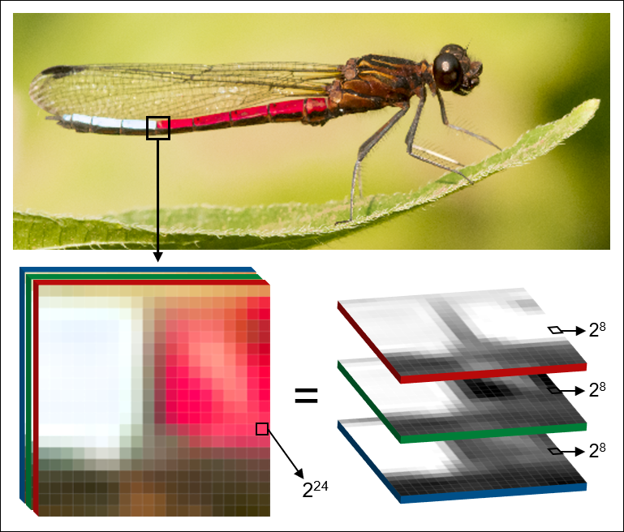

Additional resources
====================

Computer vision
---------------

Computer vision (CV) is an interdisciplinary field concerned with the automatic and semiautomatic extraction of information from digital images. We recently wrote a review about CV in the context of ecology and evolution. In the paper we give an overview of the field and describe the primary types of image-based data. This might be a good starting point if you are new to digital image analysis and CV altogether.

A preprint version of the paper is available under https://ecoevorxiv.org/98cuw/

Python
------

Python is a high-level programming language with a specific design philosophy that emphasizes code readability, e.g. through the use of indentation. It's aim is to help programmers write clear, logical code for small and large-scale projects, and is described as a "batteries included" language due to its comprehensive standard library. (source: https://www.python.org/about/)

Philisophy and style

- https://www.python.org/dev/peps/pep-0020/
- https://www.python.org/dev/peps/pep-0008/

Python intro

- https://docs.python-guide.org/

Tutorials

- https://docs.python.org/3/tutorial/
- https://py-tutorial-de.readthedocs.io/de/python-3.3/ (German)

Helpful questions on StackOverflow

- https://stackoverflow.com/questions/155609/whats-the-difference-between-a-method-and-a-function
- https://stackoverflow.com/questions/509211/understanding-slice-notation
- https://stackoverflow.com/questions/1977362/how-to-create-module-wide-variables-in-python
- https://stackoverflow.com/questions/16476924/how-to-iterate-over-rows-in-a-dataframe-in-pandas

YAML
----

"YAML" is a recursive acronym for "YAML Ain't Markup Language". YAML is a human-readable data-serialization language, commonly used for configuration files and in applications where data is being stored or transmitted. It uses both Python-style indentation to indicate nesting (source: https://yaml.org/spec/1.2/spec.html)

YAML specifications

- https://en.wikipedia.org/wiki/YAML
- https://yaml.readthedocs.io/en/latest/overview.html
- https://www.tutorialspoint.com/yaml/yaml_introduction.htm

OpenCV
------

OpenCV (Open Source Computer Vision Library) is a library of programming functions for real-time computer vision. OpenCV is powering most of phenopype's image analysis functions so that phenopype is - in large parts, but not exclusively - a wrapper for OpenCV. If you would like to see more OpenCV function being integrated into phenpype, please get in touch with me.

API doc and tutorials

- https://docs.opencv.org/3.4.9/
- https://docs.opencv.org/3.4.9/d6/d00/tutorial_py_root.html
- https://opencv-python-tutroals.readthedocs.io/en/latest/py_tutorials/py_setup/py_intro/py_intro.html

Examples

- https://docs.opencv.org/3.4.9/pages.html
- https://github.com/opencv/opencv/wiki

Morphological operations

- https://docs.opencv.org/3.4.9/d9/d61/tutorial_py_morphological_ops.html
